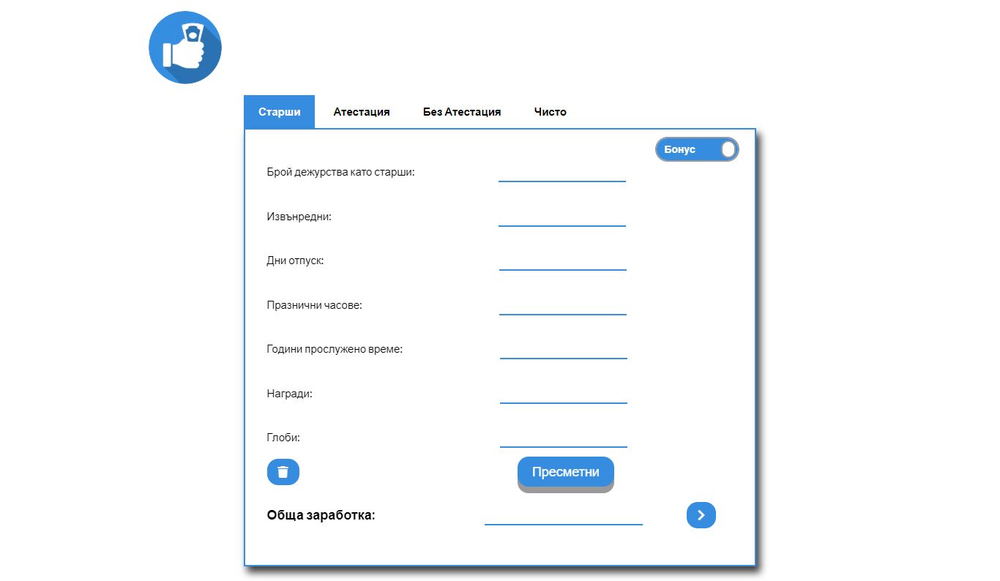

# OKCSalary

###### Web app for calculating a monthly salary made for a private company.

## Live On

https://okcsalary.github.io/

## Source Code

https://github.com/okcsalary/okcsalary.github.io

## How To Use
1. You choose the right job from the menu tab.
2. Enter the information in the fields.
3. Press the calculate button.
4. In the total work field, the calculated amount will be displayed.
5. Click the arrow button, and the app will transfer you to a net amount.
6. Re-enter the correct values.
7. Press the calculate button.
8. You will receive the net amount in the box.  
If you mistaken one of the values, click the bucket icon button to delete all fields.

## Technologies

JavaScript, jQuery, CSS and HTML

## Author
Martin Valchev  

